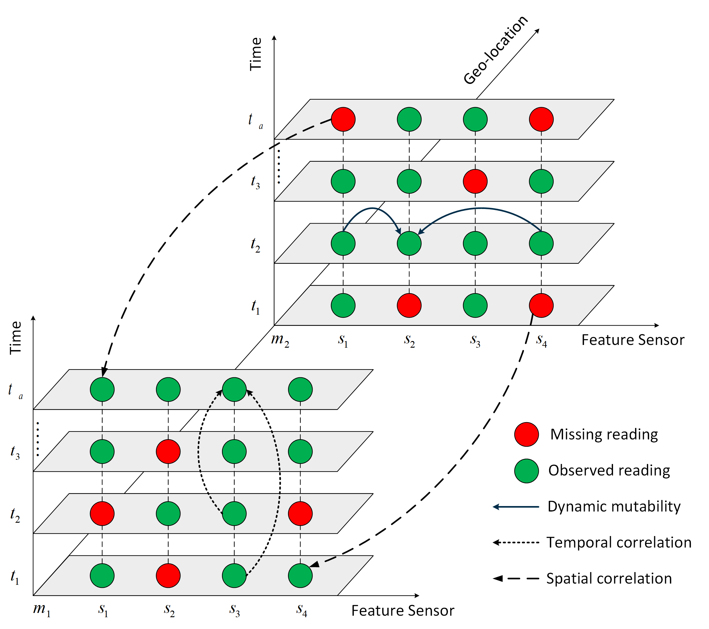
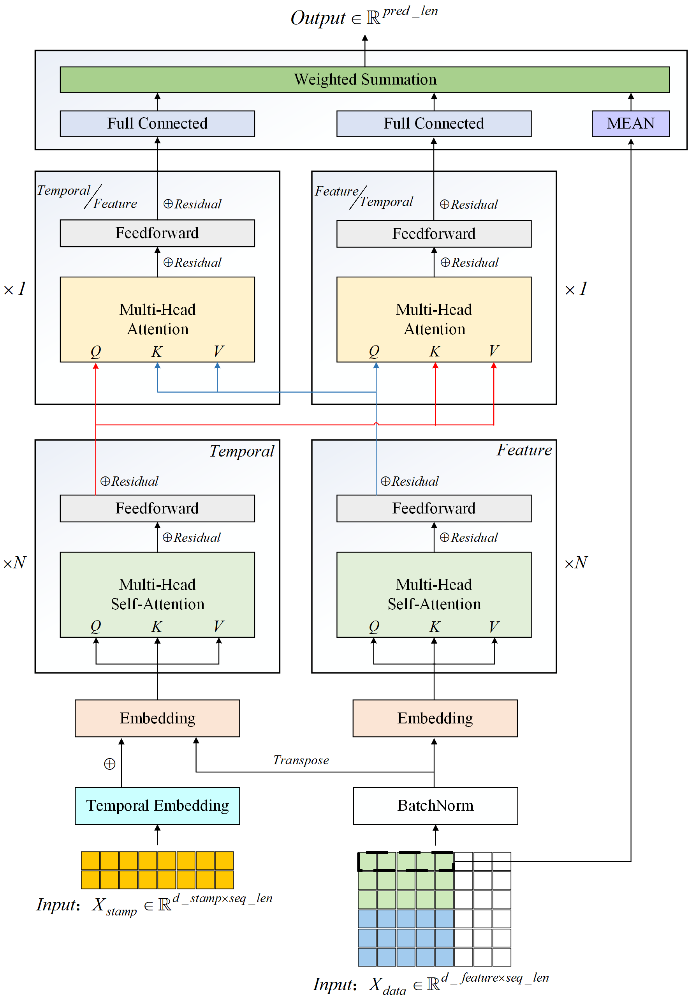

# TFAN a Temporal Feature correlations Attention based Network using novel data fusion technology for Air Quality Prediction
***A deep learning model based on Attention machinism for air quality prediction***
## 摘要 
>空气污染问题对人类的身体健康与社会的可持续发展带来了严重的威胁，精准的空气质量预测对改善空气污染、加强城市污染防治与人类健康保护具有重要意义。大多数现有研究方法对某一种空气成分的趋势分析只依赖于此属性的时间与空间数据，从而忽略了相同时间区间中其他若干空气成分对此属性变化趋势的影响。本研究提出了一种时间特征注意力深度学习模型TFAN，其通过注意力机制关注不同时间戳之间的相关性、不同特征之间的相关性与时间-特征之间的潜在联系，结合历史数据特征，对未来空气污染物浓度进行预测。本文使用北京市的空气质量数据对所提出的模型进行了全面的评估，实验结果表明TFAN相比较于多种基线模型具有优势。\
>**关键词**：空气质量;时间序列预测;注意力机制;数据融合

## Abstract
>Air pollution has a negative impact on human health and the sustainable development of society. An accurate pollutants concentration prediction is of great significance for reducing air pollution degree, strengthening urban pollution prevention, and human health protection. Many existing methods in analyzing the variation tendency of a certain air component only rely on its temporal and spatial information, but ignores the interaction between different attributes in the same time interval. This paper proposes a Temporal-Feature correlations attention-based deep learning model TFAN which contains a novel data fusion. It focuses on the correlation between different time stamps, the correlation between different features, and the potential relationship between time-features through the attention mechanism. The TFAN also combines the historical data characteristics to predict the future air pollutant concentration. The actual air quality data of Beijing City is used to comprehensively evaluate the proposed model, and the experimental results show that TFAN has advantages over multiple baseline models. \
>**Key Words**：air quality；time series prediction；attention mechanism；data fusion

Please cite as:\
`under review`

## Introduction
The development of society and progress of civilization has  brought convenience to people's life, but it has also brought a series of destruction to the natural environment, especially the air pollution problem. The harmful gases and particulates exposed to the air pose a serious threat to human health and the sustainable development of society. Air Pollutants include PM2.5, NO2, CO, etc. They are mainly from the burning of fossil fuels, power plants, and heavy industries. PM2.5 was the fifth-ranking mortality risk factor in 2015. Moreover, particulate matter and NO2 can cause irreversible respiratory disease, longer-term exposure of both also greatly increases the risk of death from cardiovascular disease and shortens life expectancy. Air quality prediction is of great significance for reducing air pollution degree, strengthening urban pollution prevention， and human health protection.\
However, forecasting air quality data is challenging for three reasons as follows:
* The dynamic mutability of air quality data Due to the interaction of different
* Sensor-level intra-characteristics and external factors
* Complex temporal correlation and unstable spatial correlation
The Example of geo-sensory multivariate time series and the illustration of dynamic interaction is as follow:

## Architecture
Self-Attention is also used in TFAN to concentrate the timestamp dimension and the feature dimension separately. It can fully learn their respective data distributions. Moreover, we carry out the attention calculation of Temporal-Feature and Feature-Temporal after Self-Attention. \
the Architecture of TFAN is as follow:

## Code
- [Code for data process](https://github.com/SY-Ma/TFAN-a-Temporal-Feature-correlations-Attention-based-Network-using-novel-data-fusion-technology-for/blob/main/data_process/data_processer.py)
- [Code for network, train and test](https://github.com/SY-Ma/TFAN-a-Temporal-Feature-correlations-Attention-based-Network-using-novel-data-fusion-technology-for/blob/main/model/OURS_TF_score.py)

## Result
- The comparison of pollutants concentration prediction precision of various model please see in paper
- The general fit of TFAN on six pollutants which be part of the same sample from test dataset. is as follow:

